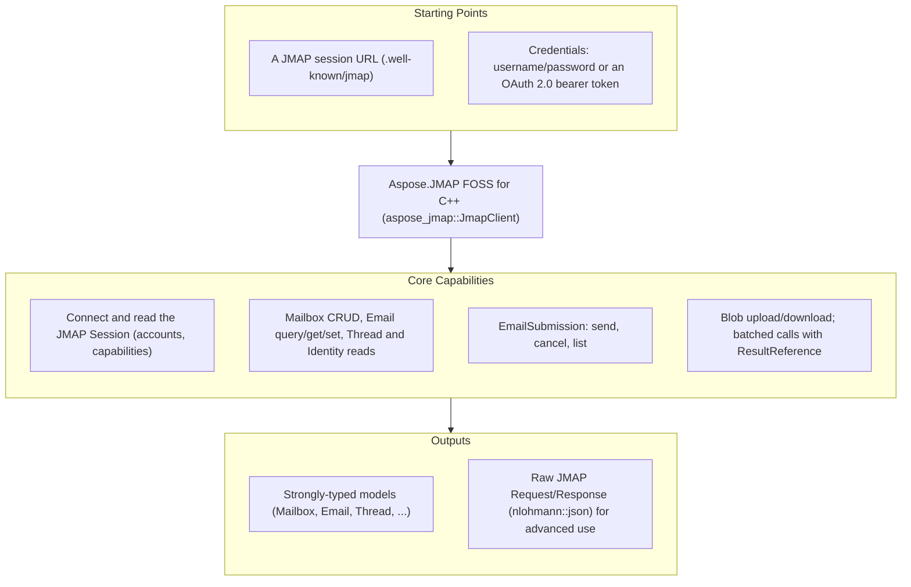

# Aspose.JMAP FOSS for C++

[](LICENSE) [](CMakeLists.txt) [](https://github.com/aspose-email-foss/Aspose.JMAP-FOSS-for-Cpp/graphs/contributors)

[](https://products.aspose.org/jmap/cpp/)

Aspose.JMAP FOSS for C++ is a free, open source, header-only JMAP client library for C++20 — for
talking to a [JMAP](https://jmap.io) mail server over HTTP:
[RFC 8620](https://www.rfc-editor.org/rfc/rfc8620) Core (session, `Core/echo`, blob
upload/download, batched method calls) and [RFC 8621](https://www.rfc-editor.org/rfc/rfc8621)
Mail (Mailbox/Email/Thread/Identity/SearchSnippet) plus EmailSubmission. Its public API is
styled after Aspose.Email's client conventions — a client object plus an options struct, a
`connect()` call that returns the session, and strongly-typed message and folder models. The
only bundled dependency is `nlohmann::json`, fetched automatically by CMake.

**This is an official Aspose open-source project. It does not contain or reference Aspose.Email
proprietary source.** The library is generated from hand-authored JMAP protocol specifications.

## Navigation

- [At a Glance](#at-a-glance)
- [Key Capabilities](#key-capabilities)
- [Installation](#installation)
- [Dependencies](#dependencies)
- [Quick Start](#quick-start)
- [Additional Examples](#additional-examples)
- [API Reference](#api-reference)
- [Documentation & Resources](#documentation--resources)
- [Scope and Limitations](#scope-and-limitations)
- [Development and Testing](#development-and-testing)
- [License](#license)

## At a Glance



## Key Capabilities

- **Connect and inspect the session** — `client.connect()` fetches `/.well-known/jmap` and
  returns the `Session` (account ids, `capabilities`, `apiUrl`, `uploadUrl`, `downloadUrl`).
- **Mailboxes** — `listMailboxes()`, `getMailbox()`, `createMailbox()`, `deleteMailbox()` wrap
  `Mailbox/get`, `Mailbox/query`, and `Mailbox/set`.
- **Messages** — `listMessages()`, `fetchMessage()`, `moveMessage()`, `setMessageKeyword()`,
  `deleteMessage()` over `Email/query`, `Email/get`, and `Email/set`.
- **Identities** — `listIdentities()` over `Identity/get`.
- **Sending** — `send()`, `cancelSend()`, `listSubmissions()` wrap `EmailSubmission/set` and
  `EmailSubmission/get`.
- **Blobs** — `uploadBlob()` / `downloadBlob()` for `/upload` and `/download`.
- **Batching** — `sendRequest()` sends any list of `Invocation`s in one HTTP round trip, with
  `ResultReference` ([RFC 8620 §3.7](https://www.rfc-editor.org/rfc/rfc8620#section-3.7)) to
  chain one call's result into the next.
- **Pluggable transport** — the client takes a `Transport` interface; every unit test supplies a
  hand-written fake, so no test needs a network.
- **OAuth 2.0** — a `bearerToken` option ([RFC 6750](https://www.rfc-editor.org/rfc/rfc6750)) as
  an alternative to HTTP Basic.

## Installation

No package has been published to a registry. Consume the library from source with CMake — add it
as a subdirectory of your own build, or use `FetchContent`:

```cmake
add_subdirectory(Aspose.JMAP-FOSS-for-Cpp)
target_link_libraries(your_app PRIVATE aspose-jmap-foss-cpp)
```

Because the library is header-only, you can also just add `include/` to your include path and
`#include "JmapClient.hpp"` directly, as long as `nlohmann/json.hpp` is discoverable.

## Dependencies

### Required Package Dependencies

`nlohmann::json` only — fetched automatically by the project's CMake (`FetchContent`). No other
third-party library is required to build, use, or test the code.

### Native and System Requirements

- A C++20 compiler.
- CMake 3.20 or later.

### Development Dependencies

- None. Tests are a plain CTest-registered executable built against the standard library — no
  external test framework is fetched.

## Quick Start

```cpp
#include "JmapClient.hpp"

aspose_jmap::JmapClientOptions options;
options.sessionUrl = "https://jmap.example.test/.well-known/jmap";
options.username = "user@example.test";
options.password = "secret";
aspose_jmap::JmapClient client(options);
auto session = client.connect();
```

## Additional Examples

### OAuth 2.0 bearer token authentication

Authenticate with an OAuth 2.0 bearer token
([RFC 6750](https://www.rfc-editor.org/rfc/rfc6750)) instead of username/password — when
`bearerToken` is set to a non-empty value it takes precedence:

```cpp
aspose_jmap::JmapClientOptions options;
options.sessionUrl = "https://jmap.example.test/.well-known/jmap";
options.bearerToken = "eyJhbGciOi..."; // OAuth 2.0 access token
aspose_jmap::JmapClient client(options);
auto session = client.connect();
```

<details>
<summary>Batching requests with ResultReference</summary>

Multiple method calls can be batched into a single HTTP round trip via `sendRequest`, using a
`ResultReference` ([RFC 8620 §3.7](https://www.rfc-editor.org/rfc/rfc8620#section-3.7)) to chain
a later call to an earlier one's result without a second request:

```cpp
aspose_jmap::Invocation query{"Email/query", {{"accountId", accountId}}, "c1"};

aspose_jmap::ResultReference ref{"c1", "Email/query", "/ids"};
aspose_jmap::Invocation get{"Email/get", {{"accountId", accountId}, {"#ids", ref.toJson()}}, "c2"};

nlohmann::json resp = client.sendRequest({query, get}, {"urn:ietf:params:jmap:mail"});
```

</details>

## API Reference

`aspose_jmap::JmapClient` (with `JmapClientOptions`) is the single entry point; the model types
`Session`, `Mailbox`, `Email`, `EmailAddress`, `Thread`, `Identity`, `EmailSubmission`, and
`SearchSnippet` mirror the JMAP objects one-to-one, and `Invocation` / `ResultReference` model
raw method calls for `sendRequest`. Errors surface as `JmapNetworkException` (transport) and
`JmapProtocolException` (a JMAP method-level error); per-item `Set` failures are returned as
data on the result rather than thrown.

The full protocol/API reference, rendered from the same specs that drive generation, is
[`docs/api-reference.md`](../../docs/api-reference.md) at the repository root.

## Documentation & Resources

- **[Getting started guide](https://docs.aspose.org/jmap/cpp/)** — installation and walkthroughs.
- **[API reference](https://reference.aspose.org/jmap/cpp/)** — browsable reference for the public types.
- **[How-to guides & FAQ](https://kb.aspose.org/jmap/cpp/)** — task-focused answers.
- **[Protocol/API reference](../../docs/api-reference.md)** — the in-repo reference rendered from the specs.
- **[Changelog](../../CHANGELOG.md)**, **[Contributing guide](../../CONTRIBUTING.md)**, **[Security policy](../../SECURITY.md)**.
- Found a bug or have a feature request? [Open an issue](https://github.com/aspose-email-foss/Aspose.JMAP-FOSS-for-Cpp/issues) on GitHub.

## Scope and Limitations

- **Protocol**: JMAP Core (RFC 8620) and JMAP Mail (RFC 8621: Mailbox/Email/Thread/Identity/SearchSnippet)
  plus EmailSubmission.
- **Out of scope for v1**:
  - Push / `EventSource` streaming — the type exists but is a stub/no-op.
  - JMAP for Calendars and Contacts.
  - `Date`/`UTCDate` values are kept as raw RFC 3339 strings (no time-point parsing) to avoid
    timezone-conversion bugs.
- **Platform note**: the default `Transport` implementation (`WinHttpTransport`) uses the native
  Windows WinHTTP API and is Windows-only for now. The `Transport` interface itself is portable;
  any platform can supply its own subclass via `JmapClientOptions::transport`.
- Unit tests run against a hand-written fake transport with mocked responses — no live JMAP
  server is required. A Docker-based live-server integration suite (Stalwart Mail Server) lives
  in [`infra/integration/`](../../infra/integration/README.md).

## Development and Testing

```bash
git clone https://github.com/aspose-email-foss/Aspose.JMAP-FOSS-for-Cpp.git
cd Aspose.JMAP-FOSS-for-Cpp
cmake -S . -B build
cmake --build build
ctest --test-dir build --output-on-failure
```

See [`infra/integration/README.md`](../../infra/integration/README.md) for the live-server suite.

## License

This project is licensed under the [MIT License](LICENSE). The MIT License permits use, copying,
modification, distribution, sublicensing, and commercial use, provided its copyright and
permission notice are retained. The software is provided without warranty.
